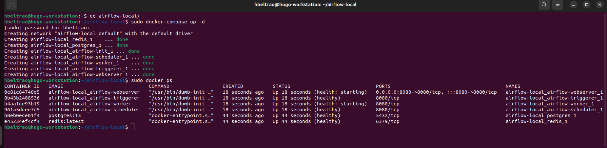
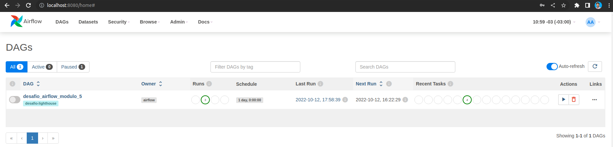
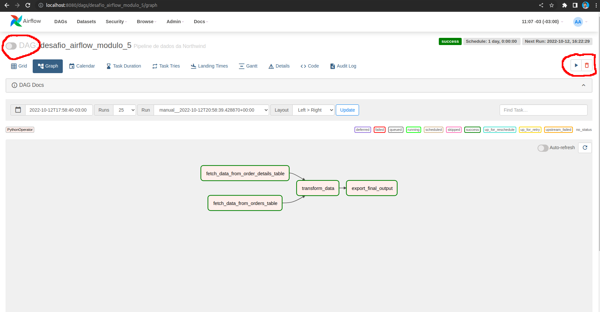

<!-- Written with [StackEdit](https://stackedit.io/). -->

  


  

# Pipeline de extração e transformação de dados de um Database SQLite

  

O pipeline deste documento foi criado com base no desafio de engenharia de dados descrito no repositório abaixo:

https://bitbucket.org/indiciumtech/airflow_tooltorial/src/main/desafio-airflow.md

O projeto consiste em extrair dados das tabelas *Order* e *OrderDetail* do banco de dados SQLite3 Northwind_small para calcular a quantidade total de itens vendidos que foram enviados para a cidade do Rio de Janeiro, conforme ilustrado na Figura-1:


<div align="center">
  <i> Figura-1: Workflow proposto </i>
</div>

O resultado obtido será concatenado com o endereço de email do dono da task (a ser configurado no airflow) , será encodado em base64 e salvo no arquivo final_output.txt.

O pipeline será executado através do Apache Airflow. Para este projeto o Airflow foi configurado e executado através do Docker. 


## Requisitos  

Os requisitos para funcionamento deste projeto são:

- Versão mais atualizada do Apache Airflow;
- Versão mais atualizada do Python;
- Bibliotecas pytrhon listadas no arquivo requirements.txt;
- *Docker instalado e atualizado (Necessário apenas caso seja utilizado o docker para instanciar os serviços  do Airflow);

OBS: caso não seja utilizado o docker para instanciar os serviços do Airflow, o arquivo requirements.txt pode sofrer alterações para acomodar os requisitos do Airflow.

### Instanciando o Apache Airflow com o Docker

Para instanciar os serviços do Apache Airflow usando Docker containers, sugere-se seguir o passo a passo do tutorial abaixo:

https://airflow.apache.org/docs/apache-airflow/stable/howto/docker-compose/index.html

Seguindo o tutorial acima deverá resultar em ter as instancias de webserver, scheduler, triggerer, worker e os bancos de metadados rodando em docker containers.

Para este projeto, foi adicionada à imagem usada no docker-compose a lista de requisitos usados no projeto, presentes no arquivo requirements.txt. Para este ajuste foi a dicionado o arquivo Dockerfile com o código abaixo:
```
FROM apache/airflow:2.4.1-python3.9
COPY requirements.txt /
RUN pip install --no-cache-dir -r /requirements.txt
```

e feito um ajuste no arquivo Docker-compose.yaml conforme instruções contidas no próprio arquivo de como usar imagens estendidas.

A estrutura de diretórios final após esta etapa deve ficar da seguinte forma:
```
airflow-local/
│
├── dags/
├── logs/
├── plugins/
│
├── dockerfile
├── docker-compose.yaml
└── requirements.txt 
```

O pipeline deste projeto será desenvolvido dentro da pasta dags, onde será criado o diretório do projeto, chamado *Job_desafio_modulo_5*.


  

## Estrutura de diretórios

O projeto possui a seguinte organização de diretórios:  

```

dags/
│
├── Job_desafio_modulo_5/
│
│	├── config/
│		└── definitions.py
│
│	├── data/
│		└── Northwind_small.sqlite
│
│	├── images/
│		├── Banner.png
│		├── DAG-instructions.png
│		├── DAGs-list.png
│		├── docker-containers-list.png
│		└── Workflow.png
│
│	├── outputs/
│		├── count.txt
│		├── final_output.txt
│		├── output_order_details.csv
│		└── output_orders.csv
│
│	└── scripts/
│		├── __init__.py
│		├── __main__.py
│		├── fetch_order_details.py
│		├── fetch_orders.py
│		└── transform_data.py
│
│	├── pipeline_DAG.py
│	├── .airflowignore
│	├── .gitignore.txt
│	├── README.md
│	└── requirements.txt
```
### Config/

Este diretório junto com o arquivo definitions.py serve para obter o caminho absoluto do projeto e salvá-lo em uma váriável. Desta forma, usando este script o código ganha portabilidiade.

### Images/

Diretório usado para guardar as imagens usadas no README.md

### outputs/

Diretório contendo os arquivos resultantes das tasks

### scripts/

Diretório contendo as tasks a serem executadas no airflow (estas tasks são referenciadas no arquivo pipeline_DAG.py, onde é estruturada a DAG)

### .airflowignore

Arquivo contendo os diretórios e arquivos que o Airflow deve  ignorar ao montar os volumes dos containers. Este arquivo é necessário para evitar que o Airflow carregue o ambiente virtual nos containers, isto quebra o funcionamento do Airflow.

### pipeline_DAG.py

Arquivo estruturando e configurando a DAG, que consiste nas instruções de execução das tasks a serem seguidas pelo Airflow.

OBS: Para o correto funcionamento no Docker, os arquivos da pasta *outputs/* devem ser criados antes de subir os serviços do Airflow, caso contrário haverá um erro quando o Airflow escanear os arquivos para inportar a DAG.
  


## Instruções de uso

O primeiro passo a ser feito é subir os serviços do Airflow. Para isso basta abrir uma janela de terminal na pasta airflow-local e rodar o comando:
```
sudo docker-compose up
```

Para confirmar que os serviços foram carregados corretamente, pode-se usar o comando
```
sudo docker ps
``` 
e verificar a lista de containeres rodando, conforme a Figura-2:


<div align="center">
  <i> Figura-2: Lista de containers rodando no docker </i>
</div>

O Airflow pode ser acessado através do endereço http://localhost:8080/home e realizando o login (o login e senha iniciais são Login=airflow, password=airflow, mas podem ser modificados no arquivo docker-compose.yaml).

Se tudo tiver corrido bem, a pagina inicial do airflow deverá conter a DAG *desafio_airflow_modulo_5* conforme a Figura-3:


<div align="center">
  <i> Figura-3: Lista de DAGs disponíveis</i>
</div> 

O próximo passo é criar a variável *my_email* que será usada na codificação do arquivo final. Para fazer isso basta acessar o menu Admin > Variables , clicar no + , inserir os dados solicitados e salvar.

Por fim, basta dar unpause na DAG e testá-la ativando manualmente o trigger:


<div align="center">
  <i> Figura-4: Visão de Graph da DAG</i>
</div> 

na visão Graph pode-se visualizar o fluxo de execução das tasks, que coincide com o workflow proposto no início deste documento.

para verificar se a DAG foi executada com sucesso, pode-se visualizar a aba GRID e verificar os detalhes de execução.
Em caso de algum erro de execução, ir na aba Graph > clicar na task que teve a falha de execução > clicar no botão Log e analisar o log de erros para verificar a causa da falha.
